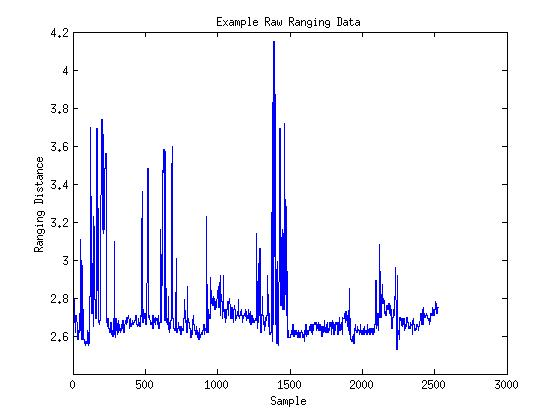
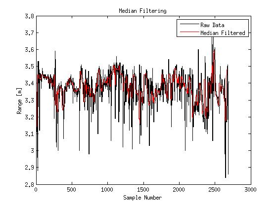

# Filtering

In our testing, we found the ranging data to be quite noisy. With only three anchors, the linear least squares algorithm is quite noise sensitive. As such, some filtering on the ranging data is necessary.

The [Arduino DWM1000 library](https://github.com/thotro/arduino-dw1000) by thotro has a built-in (exponential moving average](https://en.wikipedia.org/wiki/Moving_average#Exponential_moving_average) filter that can be enabled with a single call to `DW1000Ranging.useRangeFilter(true);`. This is a very computationally low-cost choice and definitely a good place to start.

Early on, we took some raw data from pairs of DWM1000 modules in various locations. An example of this data is below:

As you can see, the noise is dominated by sharp peaks lasting only a sample or two. For this type of noise, a median filter is often a more effective choice. While any kind of moving average filter is always going to be affected at least a little by an extremely out of range value, a median filter will allow such valus to slide through without changing output.

Shown below are the results of a simple median filter overlayed in red against another raw data set in black.

